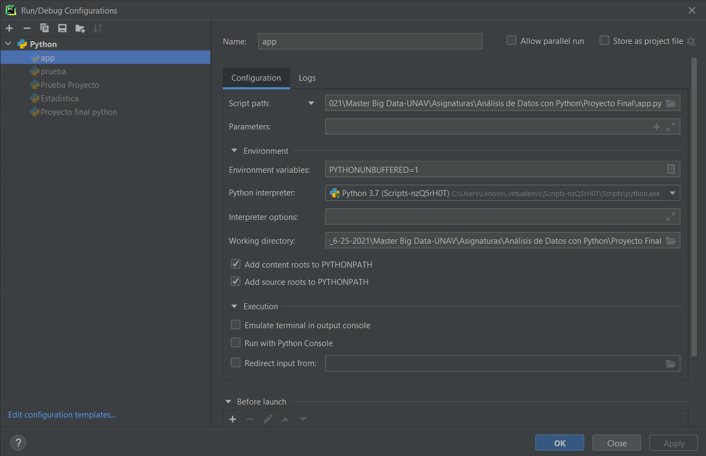
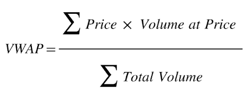
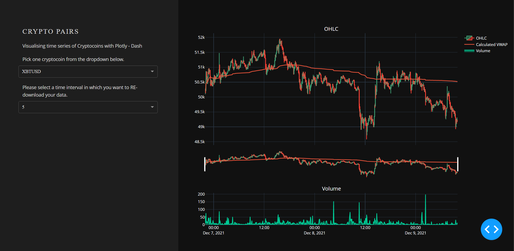

# Cryptocurrency Dashboard


A continuación se presenta la lógica y el paso a paso seguido para la realización del Dashboard de Cryptomonedas del proyecto final del curso Python Para Análisis de Datos. Cabe resaltar que si bien el actual documento corresponde a un notebook de Jupyter, la idea NO corresponde a ejecutar el mismo en esta plataforma ya que puede causar ciertos errores. Lo presente constituye una memoria ILUSTRATIVA de lo realizado, NO UN EJECUTABLE.


## Creación del Entorno Virtual


Para la creación del entorno virtual se utilizó el mecanismo del PIPENV. Se seleccionó este ya que este mecanismo brinda grandes facilidades para la creación del entorno virtual, además de que este genera el archivo PIPFILE automaticamente con todas las dependencias y paquetes/librerias instaladas al entorno virtual. 

Al crear el entorno virtual, se generó un entorno virtual Scripts-nzQ5rH0T, donde el interprete se encuentra dentro. Para lograr ejecutar el proyecto dentro el entorno es de suma importancia poner el interprete al python.exe que se encuentra dentro de esta carpeta, como se muestra a continuación:



Importante, puesto que el proyecto se realizó en un entorno virtual, las librerias se encuentran instaladas dentro del mismo. Por esta razón si se desea correr este proyecto fuera del mismo deben instalarse cada librería libreria previamente, por medio del comando 

```
$ pip install libreria
```

Es por esta razón que el proyecto no puede ejecutarse dentro de este notebook. En caso de ser instaladas, el proyecto logrará ser ejecutado, sin embargo no se presentará nada al cargar el LOCALHOST puesto por estar en este ambiente de programación (jupyter). 

En conjunto con el archivo app.py adjunto, se encontrará un archivo requirements.txt con las librerías necesarias en conjunto con sus versiones.

Las librerias instaladas al entorno virtual corresponden a las siguientes: 


```
import krakenex
from pykrakenapi import KrakenAPI
import requests
import pandas as pd
import dash
import dash_core_components as dcc
import dash_html_components as html
from dash.dependencies import Input, Output
import numpy as np
import plotly.graph_objects as go
from plotly.subplots import make_subplots
```

Respectivamente, estas librerias son de utilidad para la conexión a la API de kraken (pykrkaenapi, requests), descarga de datos OHLC (krakenex, requests), manipulación y creación de DataFrames (pandas), creación de aplicaciones tipo dash (dash y sus dependencias), manejo de "arrays" y funciones matemáticas (numpy), así como los paquetes de visulización (plotly)

## Conexión a la api de Kraken


Para la correcta realización del proyecto, es necesario realizar una conexión a la API de kraken para así poder hacer uso de sus funciones así como la descarga de sus datos. A continuación presento las líneas de código utilizadas para esto

```
api = krakenex.API()
k = KrakenAPI(api)
dict_names = requests.get('https://api.kraken.com/0/public/Assets').json()
```

La primera línea de código anterior, conecta a la API para así poder dar uso de la interface de cryptocurrency exchange. La segunda línea de código implementa los métodos de la API de kraken para el uso de los mismos con el paquete de krakenex. Por último, la conexión a kraken por medio de requests, permite la descarga de un archivo .json (el cual se convirtió a diccionario) con los datos de todos los pares disponibles y visibles en kraken para la descarga. 


Importante mencionar que al estar trabajando con dash debemos inicializar el app con las siguientes lineas de código


```
app = dash.Dash(__name__)
app.title = "Cryptopairs Dashboard"
```

## Descarga de Datos y Manipulación de los mismos

### Información pares disponibles

Se realizaron dos descargas principales de datos desde la API de kraken. La primera, que se explica a continuación, busca descargar todos los pares disponibles en kraken, esto con el fin de poder incluir la mayor cantidad de pares en el dropdown que se creará posteriormente para la aplicación

```
df = pd.Series(dict_names)
names_info = pd.DataFrame(df[1]).T
# Descarga de todos los pares de Kraken
pairs = k.get_tradable_asset_pairs()
```

Este tracto de código anterior genera un DataFrame llamado PAIRS, el cual, como se explicó anteriormente, posee información de TODOS los pares presentes en kraken. La manipulación posterior consta de un bucle, FOR, para seleccionar ÚNICAMENTE los pares que se desea ver su conversión ya sea en EUROS (EUR) o en DOLARES (USD)

```
pairs["new_name"] = np.nan
new_name_df = pd.DataFrame()

# Loop para encontrar unicamente pared a USD y EUR
for indice, valor in enumerate(pairs["altname"]):
    if valor[-3:] == "USD" or valor[-3:] == "USD":
        pairs.iloc[indice, -1] = valor

pairs = pairs.dropna()
new_name_df["name"] = pairs["new_name"]

# Arreglo de intervalos de tiempo
range_time = np.array([5, 60, 1440])
```

### Datos OHLC de cryptopares


Se realizaron 3 funciones para poder descargar los datos OHLC, manipular los mismos y calcular el indicador VWAP. Las mismas se explican a continuación.

#### Función 1: descarga_OHLC

```
# Funcion para descargag df de kraken con OHLC
def descarga_OHLC(name, range1):
    # Descarga de ultimos 720 valores de cryptopair en dias
    data_OHLC_tuple = k.get_ohlc_data(name, interval=range1, ascending=True)
    # Creacion del DataFrame descargado
    data_OHLC = data_OHLC_tuple[0]
    return data_OHLC
```

Esta función descarga los datos de Open High Low Close (OHLC) en un DataFrame, por medio de dos argumentos:

- name: Nombre del par que se desea descargar (string)

- range1: intervalo de tiempo entre dato y dato descargado (int)

Esto se logra por medio de una función de krakenex llamada GET_OHLC_DATA, la cual recibe los argumentos previamente descritos. Importante mención, esta función de krakenex guarda la descarga en una tupla, de la cual nos interesa únicamente su entrada 1 (posición 0) que es un DataFrame con 720 valores de la fecha, hacía atrás.

Esta función retorna el dataframe con la información OHLC y volumen del par de la cryptomoneda seleccionada

#### Función 2: manipulacion_OHLC 

```
# Funcion para manipulacion interna de df descargado
def manipulacion_OHLC(data_frame_desc):
    data_frame_desc["time"] = pd.to_datetime(data_frame_desc["time"], unit='s', origin='unix')
    # Creacion de columna nombre e indice
    data_frame_desc["name"] = "XBTUSD"
    data_frame_desc["index"] = 0
    data_frame_desc["vwap_calculado"] = 0
    for indice1, valor1 in enumerate(data_frame_desc["name"]):
        data_frame_desc.iloc[indice1, -2] = indice1
    return data_frame_desc
```

El DataFrame creado por medio de la función descarga_OHLC es manipulado y tratado en esta función que se explica (manipulación_OHLC). La idea corresponde en:

- Convertir la columna de fecha del DataFrame en de UNIX a una fecha ordinaria
- Agregar una columna al DataFrame con el nombre del par descargado (nombre en cada posición)
- Inicializar dos columnas, indice y VWAP_CALCULADO

La función regresa el mismo DataFrame descargado manipulado

#### Función 3: calculo_VWAP 

```
# Funcion para la creacion de del VWAP calculado
def calculo_VWAP(data_frame_manip):
    num = []
    den = []
    for indice1, valor2 in enumerate(data_frame_manip["vwap_calculado"]):
        if indice1 == 0:
            #Precio * volumen
            num.append(data_frame_manip.iloc[indice1, 5] * data_frame_manip.iloc[indice1, 6])
            #Volumen
            den.append(data_frame_manip.iloc[indice1, 6])
            #Asignación a la columna de vwap de la formula
            data_frame_manip.iloc[indice1, -1] = num[indice1] / den[indice1]
        else:
            #Precio * Volumen
            num.append(data_frame_manip.iloc[indice1, 5] * data_frame_manip.iloc[indice1, 6] + num[indice1 - 1])
            #Volumenn
            den.append(data_frame_manip.iloc[indice1, 6] + den[indice1 - 1])
            #Asignación a la columna de vwap de la formula acumulado
            data_frame_manip.iloc[indice1, -1] = num[indice1] / den[indice1]
    return data_frame_manip
```

Esta última función en cuestión calcula el indicador de "trading" VWAP, el cual corresponde al precio ponderado por volumen de transacciones. Dado que se necesita realizar un acumulado, se realizan estas operaciones en un bucle, acumulando valores en listas y por medio de las mismas, realizar las operaciones matemáticas. El bucle, FOR, corre por todas las posiciones del DataFrame para realizar el cálculo y guardar el mismo



La imagen anterior muestra la fórmula utilizada para el cálculo, donde el precio utilizado corresponde al mostrado en la columna "vwap" del DataFrame descargado.

La función, retorna el DataFrame descargado pero con la columna de VWAP Calculado rellena.

## Layout de la Aplicación en Dash 

```
# Layout del app en dash
app.layout = html.Div(
    children=[
        html.Div(className='row',  # Define the row element
                 children=[
                     html.Div(className='four columns div-user-controls',
                              children=[
                                  html.H2('CRYPTO PAIRS'),
                                  html.P('''Visualising time series of Cryptocoins with Plotly - Dash'''),
                                  html.H2(''''''),
                                  html.P('''Pick one cryptocoin from the dropdown below.'''),
                                  dcc.Dropdown(
                                      id="Crypto_Selection",
                                      options=[{"label": crypto, "value": crypto}
                                               for crypto in np.sort(new_name_df.name.unique())],
                                      # placeholder="Select a Cryptocoin",
                                      value="XBTUSD",
                                      clearable=False,
                                      className="dropdown",
                                  ),
                                  html.H2(''''''),
                                  html.P('''Please select a time interval in which you 
                                  want to RE-download your data.'''),
                                  dcc.Dropdown(
                                      id="Range_Time_Selection",
                                      options=[{"label": time_interval, "value": time_interval}
                                               for time_interval in np.sort(range_time)],
                                      # placeholder="Select a Cryptocoin",
                                      value=5,
                                      clearable=False,
                                      className="dropdown",
                                  )
                              ]),
                     # Define the left element
                     html.Div(className='eight columns div-for-charts bg-grey',
                              children=[
                                  html.Div(
                                      dcc.Graph(id='Crypto_Graph',
                                                config={'displayModeBar': False},
                                                animate=True,
                                                )),
                              ]
                              )  # Define the right element
                 ]
                 ),
    ]
)
```

El código muestra el layout creado para la aplicación de Dashboard de Cryptomonedas. Se divide en dos columnas, 

- La columna izquierda, más delgada, consta de dos dropdown, uno que permiten al usuario seleccionar diferentes pares de cryptomonedas a visualizar y otro que permite al usuario seleccionar el intervalo de tiempo entre cada toma de datos de la descarga. El gráfico se actualiza gracias a un callback implementado (se explicará a detalle más adelante)
- La columna derecha, la más ancha, consta del gráfico principal. Un gráfico de velas que muestra el OHLC para cada uno de los 720 valores descargados, el VWAP Calculado y el Volumen de transacciones para interpretar de mejor manera el VWAP. Se ha implementado un RANGE SLIDER que permite visualizar el grafico a mayor detalle si se redefine la busqueda. 



Para lograr el estilo, se creó un archivo llamado style.css dentro de una carpeta de la raiz, llamada assets.

## Dash Callback para diferentes pares e intervalos

```
# Callback y su funcion para poder actualizar tiempo y cryptomoneda seleccionada
@app.callback(
    [Output('Crypto_Graph', 'figure')],
    [
        Input('Crypto_Selection', 'value'),
        Input('Range_Time_Selection', 'value'),
    ]
)
def update_charts(name, date):
    # Grafica de Precio de Cryptopar

    data_OHLC_graph = descarga_OHLC(name, date)
    data_OHLC_graph = manipulacion_OHLC(data_OHLC_graph)
    data_OHLC_graph = calculo_VWAP(data_OHLC_graph)

    high_crypto_price = make_subplots(rows=2, cols=1, shared_xaxes=True,
                                      vertical_spacing=0.25, subplot_titles=('OHLC', 'Volume'),
                                      row_width=[0.2, 0.7])

    # Plot OHLC on 1st row
    high_crypto_price.add_trace(
        go.Candlestick(x=data_OHLC_graph["time"], open=data_OHLC_graph["open"], high=data_OHLC_graph["high"],
                       low=data_OHLC_graph["low"], close=data_OHLC_graph["close"], name="OHLC"),
        row=1, col=1
    )

    high_crypto_price.add_trace(
        go.Scatter(x=data_OHLC_graph['time'], y=data_OHLC_graph['vwap_calculado'], name="Calculated VWAP"), row=1,
        col=1)

    # Bar trace for volumes on 2nd row without legend
    high_crypto_price.add_trace(
        go.Scatter(x=data_OHLC_graph['time'], y=data_OHLC_graph['volume'], fill='tozeroy', name="Volume"), row=2,
        col=1)

    # Do show OHLC's rangeslider plot
    high_crypto_price.update(layout_xaxis_rangeslider_visible=True)

    high_crypto_price.update_layout(width=1002, height=753, autosize=False, template="plotly_dark")

    return [go.Figure(data=high_crypto_price)]
```

Por medio del callback y su respectiva función, es posible interactuar con la aplicación creada. 

El callback consta de dos argumentos esenciales:

- Output: se conecta a la división html creada para la gráfica "Crypto_Graph" y especifica que debe mostrar (y cambiar) su gráfica
- Input: cconsta de todas las interacciones que se tendrán con la aplicación, que harán que esta cambie. En este caso se tienen 2, ambas relacionadas con un dropdown, par de cryptomonedas y rango de tiempo especificamente.

La función del callback contiene el cuerpo "importante" de la aplicación, esta recibe como argumentos, los inputs presentes en el callback.

Dentro de esta función se inicializaron las funciones creadas con anterioridad, lo que permitirá que cada vez que se realice se haga una nueva selección en los dropdown, estas sean actualizadas de igual manera, es decir, un nuevo DataFrame se creará. 

Por su parte, las gráficas están aqui dentro, ya que estas también se actualizan con cada nueva selección. 
Se ha creado una gráfica principal HIGH_CRYPTO_PRICE, la cual se divide en dos filas (OHLC y Volumen). La fila 1 muestra el grafico de velas (OHLC en conjunto con el VWAP Calculado), se le añade por debajo un slider que permite detallar en los valores específicos de cada dato. La segunda fila contiene el volumen graficado por medio de área para que el mismo sea más visual.

## Funcionalidad 

Finalmente para que el app sea completamente funcional, se agregan los siguientes comandos

```
if __name__ == "__main__":
    app.run_server(debug=True)
server = app.server
```

## Distribución de la aplicación (Heroku)

La distribución de la aplicación se da por medio de heroku, utilizando de igual manera el git bash, creando un repositorio .git. Se siguen los pasos que se mencionan a continuación: 

Se crean 3 archivos en la raíz del proyecto

1. El primero llamado runtime.txt con el siguiente contenido:

```
python-3.9.1
```

2. El segundo corresponde a los requerimientos, que posee todos las versiones con sus respectivas versiones. requirements.txt

```
- dash==2.0.0
- gunicorn==20.1.0
- krakenex==2.1.0
- numpy==1.21.2
- pandas==1.3.3
- plotly==5.4.0
- pykrakenapi==0.2.2
- requests==2.26.0
```

3. El tercer archivo corresponde al archivo Procfile, sin ninguna extensión, con el siguiente contenido: web: gunicorn app:server
4. Creación del repositorio .git

```
- git init .
- git add .
- git commit -m "My first commit"
```

Estos pasos finales (4) crean el repositorio .git. Dentro de la carpeta del proyecto.

5. Dentro del heroku CLT se corren los siguientes dos comandos, 

```
- heroku create
- heroku git:remote -a frozen-shelf-06550
```

Estos pasos (5) crean la aplicación en heroku y permiten ejecutarla.

El link que presento a continuación corresponde al app desplegada con heroku. El nombre del app es FROZEN-SHELF-06550: 

https://frozen-shelf-06550.herokuapp.com/

## Como usar la aplicación

Para utilizar la aplicación creada, únicamente es necesario dar click en el link que se presenta en el apartado de arriba.

Para interactuar con la misma, es necesario seleccionar valores y pares de los dropdowns mostrados a la izquierda. Esto hará que la gráfica cambie, sin embargo, por un bug que el app posee, 
#### ES NECESARIO DAR DOBLE CLICK SOBRE EL GRÁFICO UNA VEZ SELECCIONADA UNA NUEVA MONEDA O UN NUEVO INTERVALO DE TIEMPO PARA QUE ASÍ ESTE SE ACTUALICE

 De la misma manera, por un bug que posee el app, 
 #### EL EJE VERTICAL NO SE ACTUALIZA AL VALOR DE LA CRYPTOMONEDA RESPECTO AL PAR 


